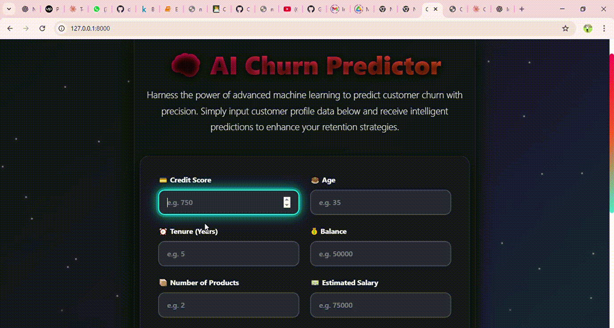

# 🧠 Customer Churn Prediction – End-to-End MLOps Project



This is a production-ready **Machine Learning Operations (MLOps)** project focused on predicting **customer churn** using a real-world dataset from ABC Multistate Bank. It demonstrates the full ML lifecycle: from data ingestion and model experimentation to CI/CD, containerization, and deployment using modern MLOps practices.

---

## 📌 Problem Statement

Customer churn is a pressing issue in industries like telecom, banking, and SaaS, where retaining existing customers is far more cost-effective than acquiring new ones. This project builds a churn prediction system that identifies customers at risk of leaving based on their profile and activity.

---

## 📦 Key Highlights

- ✅ **Modular ML pipeline** (ingestion → preprocessing → training → evaluation)
- 🧪 **Experiment tracking** with **MLflow**
- 📦 **Data versioning** via **DVC**
- 🐳 **Dockerized** application for reproducible environments
- ☁️ **Azure-ready deployment** (via Container Registry & VMs)
- ⚙️ **CI/CD** with **GitHub Actions**
- 🔍 **Model & data drift monitoring** with **Grafana**
- 🚀 **FastAPI** backend for serving predictions
- 🎨 **Web interface** using **Jinja2 templates (HTML/CSS)**
- 📋 Custom **logging and exception handling** for reliability

---

## 🏗️ Project Structure

```
ml_project/
│
├── 📁 config/
│   └── 📝 config.yaml                # Configuration file
│
├── 📁 data/
│   ├── 📂 raw/                       # Raw data
│   ├── 📂 processed/                 # Processed data
│   └── 📂 features/                  # Feature-engineered data
│
├── 📁 models/
│   └── 🧠 model.pkl                  # Trained model
│
├── 📁 notebooks/
│   ├── 📓 01_eda.ipynb               # Exploratory Data Analysis
│   └── 📓 02_model_experiments.ipynb# Model training experiments
│
├── 📁 src/
│   ├── 📁 components/
│   │   ├── 🧩 data_ingestion.py      # Raw data loading
│   │   ├── 🧹 data_preprocessing.py  # Cleaning/preprocessing
│   │   ├── 🎯 model_training.py      # Model training
│   │   └── 📊 evaluation.py          # Evaluation metrics
│   │
│   ├── 📁 pipeline/
│   │   ├── 🔁 train_pipeline.py      # Training pipeline
│   │   └── 🔍 inference_pipeline.py  # Inference pipeline
│   │
│   └── 📁 utils/
│       ├── 📋 logger.py              # Logging utility
│       ├── ⚠️ exception.py           # Custom exceptions
│       └── 🛠️ helper.py              # Helper functions
│
├── 📁 templates/
│   ├── 🖥️ index.html                # Homepage template
│   └── 📄 result.html               # Prediction result display
│
├── 📁 static/
│   ├── 🎨 styles.css                # CSS styling
│   └── 🎞️ video/
│       └── 🖼️ churn_demo.gif        # Demo animation
│
├── 📁 mlruns/                        # MLflow tracking
│
├── 🚀 App.py                         # Web app entry point
├── 📦 dvc.yaml                       # DVC pipeline
├── 🐳 Dockerfile                     # Docker configuration
├── 📜 requirements.txt              # Project dependencies
├── 🚫 .gitignore                     # Git ignored files
├── 🚫 .dvcignore                     # DVC ignored files
├── 📘 README.md                      # Project documentation
└── 📁 .github/
    └── 📁 workflows/
        └── ⚙️ ci-cd.yml              # GitHub Actions workflow

```

---

## ✅ Model Training & Evaluation

After preprocessing and feature engineering, multiple models were trained and compared:

- 🎯 **Random Forest**
- 🎯 **XGBoostClassifier**
- 🎯 **CatBoostClassifier**
- ✅ **LightGBMClassifier** *(Final Model)*

The **LightGBMClassifier** was chosen based on superior **recall and precision** for the **positive class** (churned customers).

### 📊 Evaluation Metrics

| Metric        | Score    |
|---------------|----------|
| Accuracy      | 0.7870   |
| Precision     | 0.4746   |
| Recall        | 0.7837   |
| F1 Score      | 0.5912   |
| ROC AUC Score | 0.8604   |

✅ The model correctly identified **308 out of 393** churning customers.

---

## 🔬 MLflow Experiment Tracking

- ✅ All experiments logged via **MLflow**
- ✅ Metrics: Accuracy, Precision, Recall, F1 Score, ROC AUC
- ✅ Final model registered for reproducibility

---

## 🌐 Web Application

A lightweight web interface built using **FastAPI** and **Jinja2 templates** allows users to interact with the model and get churn predictions.

- 📌 `App.py` serves as the entry point
- 📁 `templates/` for HTML views
- 🎨 `static/` for styling and media

---

## ⚙️ Technologies Used

| Category            | Tools & Tech Stack |
|---------------------|--------------------|
| Language            | Python |
| Data Source         | [Kaggle Dataset](https://www.kaggle.com/datasets/gauravtopre/bank-customer-churn-dataset) |
| Data Processing     | Pandas, Scikit-learn |
| Modeling            | XGBoost, CatBoost, LightGBM |
| Experiment Tracking | MLflow |
| Data Versioning     | DVC + Azure Blob |
| Model Serving       | FastAPI |
| Frontend            | HTML, CSS (Jinja2 templates) |
| Containerization    | Docker |
| CI/CD               | GitHub Actions |
| Deployment Target   | Azure VM + Container Registry |
| Monitoring          | Grafana |
| Reliability         | Custom Logging & Exception Handling |

---

## 🚧 Current Progress

- ✅ Modular ML pipeline
- ✅ MLflow for tracking
- ✅ FastAPI-based app created
- ✅ HTML templates and static assets added
- ✅ CI pipeline implemented (builds Docker image on push)
- 🔄 CD pipeline in progress (Azure Container Registry + deployment)

---

## 🛠️ Next Steps

- [ ] Finalize CD pipeline to Azure
- [ ] Integrate monitoring dashboard (Grafana)
- [ ] Set up scheduled retraining
- [ ] Add unit tests and test coverage report
- [ ] Improve UI with user feedback

---

## 🚀 Getting Started

Clone the repository:

```bash
git clone https://github.com/your-username/ml-project-churn.git
cd ml-project-churn

